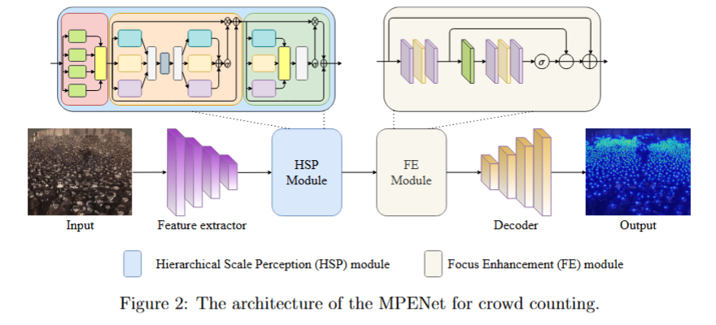
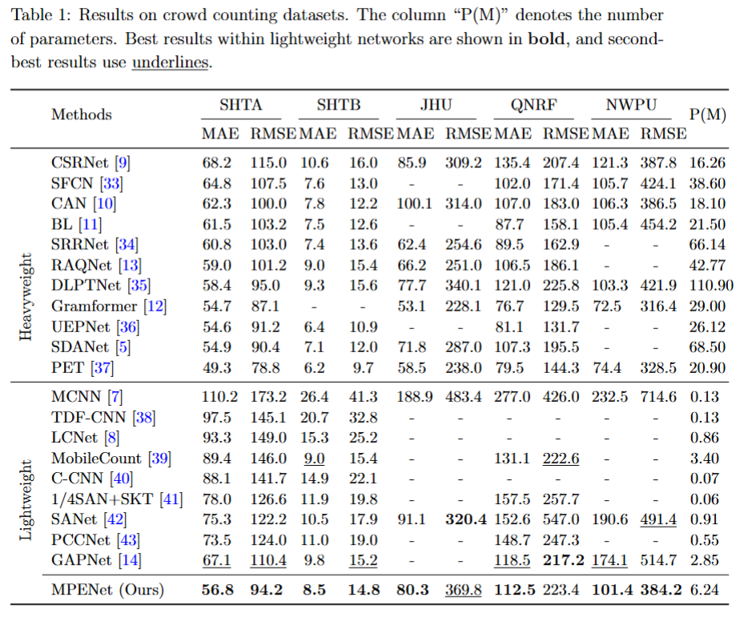
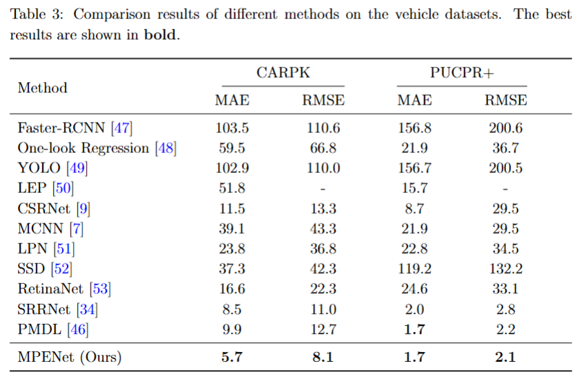
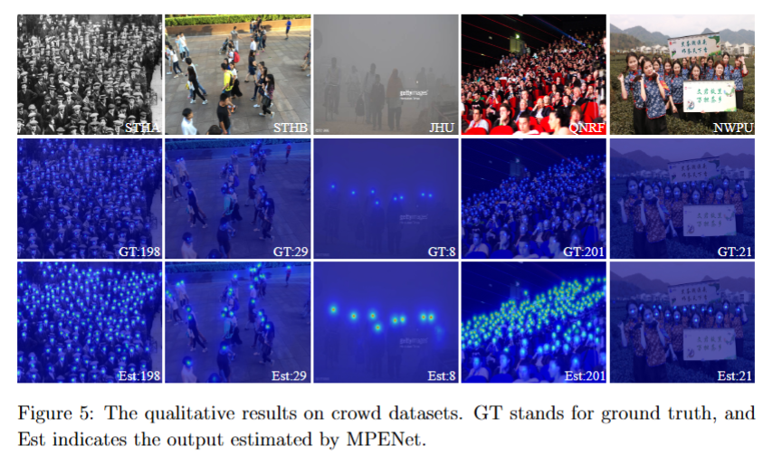
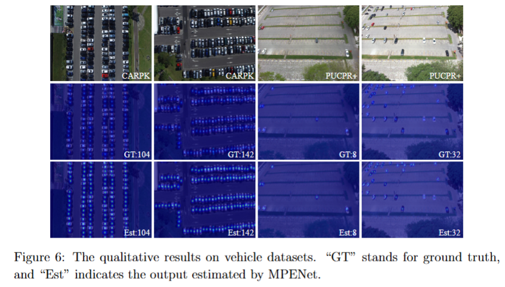

# Privacy-Preserving Crowd Counting via Quantum-Enhanced Federated Learning

This repository contains the code and resources associated with our paper titled "Multi-perception Enhanced Network for Efficient Crowd Counting". Please note that the paper is currently under review for publication.

The code is tested on Ubuntu 22.04 environment (Python3.8.18, PyTorch1.10.0) with an NVIDIA GeForce RTX 3090.

## Contents

- [Multi-perception Enhanced Network for Efficient Crowd Counting]
  - [Data Availability](#data-availability)
  - [Train](#train)
  - [Test](#test)
  - [Pretrained Weights](#pretrained-weights)
  - [Results](#results)
    - [Quantitative Results](#quantitative-results)
    - [Visual Results](#visual-results)
  - [Citation](#citation)
  - [Acknowledgements](#acknowledgements)




## Data Availability
The ShanghaiTech dataset  from [HERE](https://github.com/desenzhou/ShanghaiTechDataset).
The NWPU dataset from [HERE](https://gjy3035.github.io/NWPU-Crowd-Sample-Code/).
The UCF_QNRF dataset from [HERE](https://www.crcv.ucf.edu/data/ucf-qnrf/).
The JHU-CROWD++ dataset from [HERE](http://www.crowd-counting.com/).
The CARPK dataset and PUCPR+ dataset from [HERE]( https://lafi.github.io/LPN/).


## Train
The training code will be released after the acceptance of this paper.

1. Prepare the datasets used in the experiment.
2. Modify the data set address in `make_npydata.py` to generate the correct dataset information
3. Modify the dataset, client numbers and other options in `config.py`.
4. After performing the above modifications, you can start the training process by running `python train.py`.

## Test

To test PQNet, update the `pre` argument in `config.py` with the path to the pretrained model. Then, initiate the testing process by running `python test.py`.

## Pretrained Weights

The pretrained weights from [HERE](https://1drv.ms/f/s!Aj_OLJKSpsndgSyOIsviAZdU9fp2?e=gcCmNu).

## Results

### Quantitative Results




### Visual Results





## Citation

If you find this code or research helpful, please consider citing our paper:

```BibTeX
@article{Zhang2025MPENet,
title={Multi-perception Enhanced Network for Efficient Crowd Counting},
author={Zhang, Chen and Cheng, Jing-an and Wang, Jianyong and Zhang, Yan },
journal={under_review}
year={2025},
}
```
Please note that this citation is a placeholder and will be updated with the actual citation information once the paper is accepted and published. We kindly request you to revisit this section and replace the placeholder with the correct citation detail.

## Acknowledgements

This code is built on [OSNet](https://github.com/KaiyangZhou/deep-person-reid) and [FIDTM](https://github.com/dk-liang/FIDTM). We thank the authors for sharing their codes.
